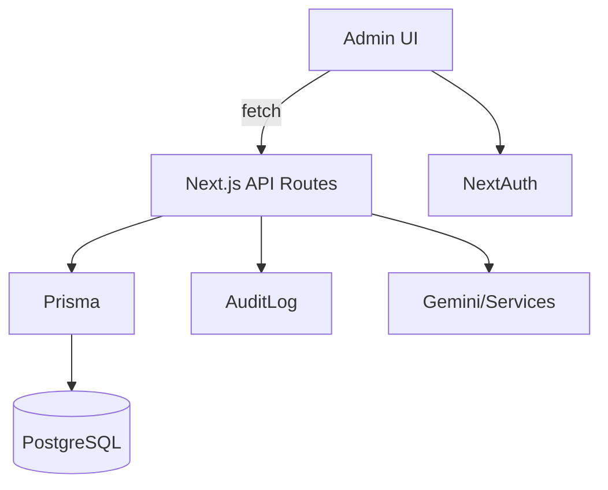

# Developer Guide

This document explains the architecture, components, and how to extend the admin panel.

## Architecture Overview
- Next.js 15 App Router with TypeScript
- Prisma ORM to PostgreSQL; Accelerate extension
- NextAuth credentials auth + middleware guard
- Admin UI built with Tailwind + Radix; Aceternity-inspired components
- React Query for client data fetching and caching
- Services for integrations (GitHub, Gemini, Email)

```text
src/
  app/
    admin/
      (pages per entity: dashboard, skills, projects, contacts, experience, education, personal, social, media, settings, audit)
      layout.tsx, providers.tsx
    api/
      public endpoints: skills, projects
      admin endpoints: admin/** with zod validation and audit logging
  components/
    aceternity/ (usage notes)
    ui/ (radix wrappers, toasts, inputs)
    sections/ (CLI/Chatbot components)
  lib/
    auth.ts (NextAuth options)
    db.ts (Prisma client with Accelerate)
  services/
    githubService.ts, githubCacheService.ts, chatbotService.ts, geminiService.ts, emailService.ts
prisma/
  schema.prisma, seed.ts
```

## Auth Flow
- /admin/login → NextAuth credentials → JWT session
- src/middleware.ts enforces admin role for /admin/**
- Session token includes id, email, name, role

## API Conventions
- App Router route handlers under src/app/api
- Admin routes validate with zod; convert arrays to JSON strings for storage
- Audit every mutating call with AuditLog model
- Bulk endpoints expose delete/status/export as applicable

## Database Models (selection)
- AdminUser, AuditLog, Skill, Project, Contact, ContactReply, Education, WorkExperience, Media, Faq, Setting
- GitHub cache models for Netlify/Neon integration

## UI Components
- Use Tailwind utility classes; keep components small and cohesive
- Radix primitives for accessibility
- Toaster: components/ui/sonner + components/ui/toast

## Extending Functionality
1. Add a new entity
   - Define model in prisma/schema.prisma
   - Run: npm run db:push && npm run db:generate
   - Create API handlers in src/app/api/admin/<entity>/route.ts (+ [id], bulk if needed)
   - Add admin pages under src/app/admin/<entity>/ (list, new, [id])
   - Add zod schemas and input components
   - Add audit logging in API handlers
2. Add public read API if needed under src/app/api/<entity>/route.ts
3. Wire UI with React Query hooks and toasts

## Real-time and Notifications
- The UI uses toasts for real-time feedback
- No WebSocket/SSE channel by default in this repo; add Pusher/Ably/SSE if needed

## Testing
- Prefer integration tests for API route handlers and zod validation
- Seed test data via prisma/seed.ts

## Code Style
- TypeScript strict where possible
- Keep functions <100 LOC; extract services
- Zod for input validation; never trust client input

## Diagrams


## Common Tasks
- Add field to model → edit schema, push, adjust zod and forms
- New bulk action → implement in /api/admin/<entity>/bulk, wire UI checkboxes
- CSV export → return text/csv with Content-Disposition header

## Troubleshooting
- Prisma client missing: npm run db:generate
- Type errors in CI: npm run build:skip-types or fix types and use build
- 401 on admin API: ensure NextAuth configured; login session present

